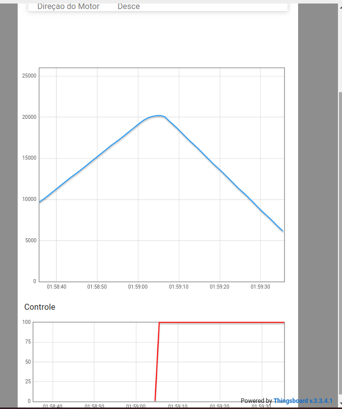
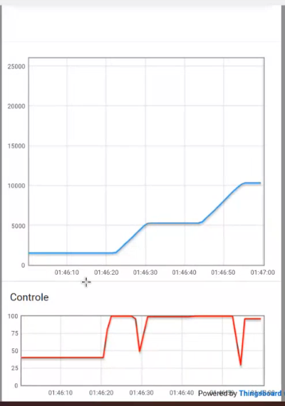
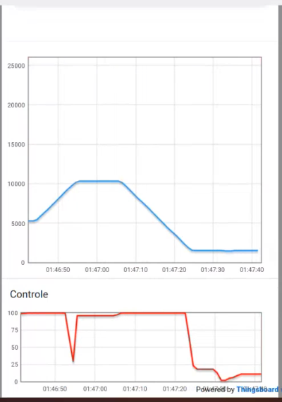
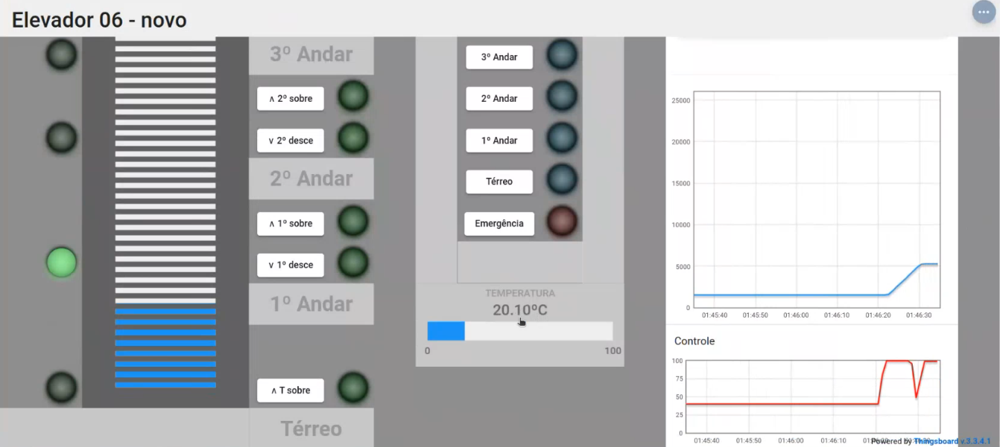
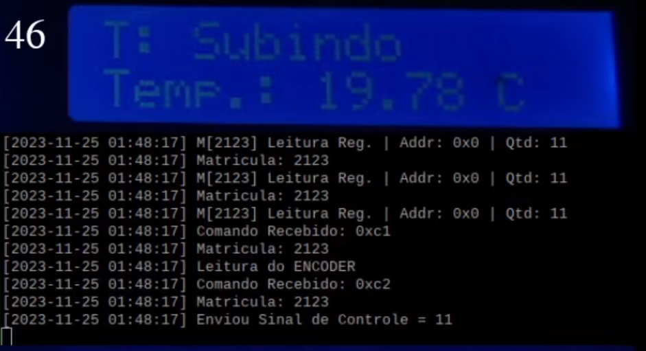

# Trabalho 2 - Fundamentos de Sistemas Embarcados

## Aluno

| Matrícula  | Aluno                                                                   |
|------------|-------------------------------------------------------------------------|
| 19/0112123 | [Lucas Gabriel Sousa Carmargo Paiva](https://github.com/lucasgabriel-2) |

## Sobre

Nesse repositório está um dos trabalhos realizados durante a disciplina de Fundamentos de Sistemas Embarcados da Universidade de Brasília, com intuito de desenvolver um software que efetua o controle completo de um elevador incluindo o controle de movimentação, acionamento dos botões internos e externos e monitoramento de temperatura. O movimento do elevador é controlado à partir de um motor elétrico e a posição é sinalizada a partir de sensores de posição e um encoder. [1]

## Instalação e execução

1- É **necessário** instalar as dependências do projeto, executando o seguinte comando na pasta raiz do projeto (trabalho-2-2023-2-lucasgabriel-2)

    pip install --upgrade -r requirements.txt 

2- Para rodar o projeto, basta executar o comando abaixo na raiz do projeto.

    python3 src/main.py

## Screenshots

### Gráficos

#### Gráfico da calibragem do elevador (posição e sinal de controle) 

 Figura 1 - Calibragem do elevador.

**Observação:** O sinal de controle só passa ser calculado após a inicialização do sistema por completo com a calibração.

#### Gráfico do elevador indo do andar Térreo para o 1º andar e em seguida para o 2º andar (posição e sinal de controle) 

 Figura 2 - Elevador subindo.

#### Gráfico do elevador indo do 2º andar ao andar Térreo (posição e sinal de controle) com o modo de emergência acionado

 Figura 3 - Elevador descendo.

### Dashboard com o elevador parado no andar Térreo e apresentando temperatura

 Figura 4 - Dashboard.

## Display LCD com temperatura, estado do elevador e o andar atual

 Figura 5 - Display LCD.

## Apresentação

<video src='./assets/gravacao.mp4'></video>

[Arquivo de apresentação](./assets/gravacao.mp4)

## Outros

## Referências

[1] Fundamentos de Sistemas Embarcados - Trabalho 2 - 2023-2. Disponível no [link](https://gitlab.com/fse_fga/trabalhos-2023_2/trabalho-2-2023-2), acesso em 24/11/2023.  
